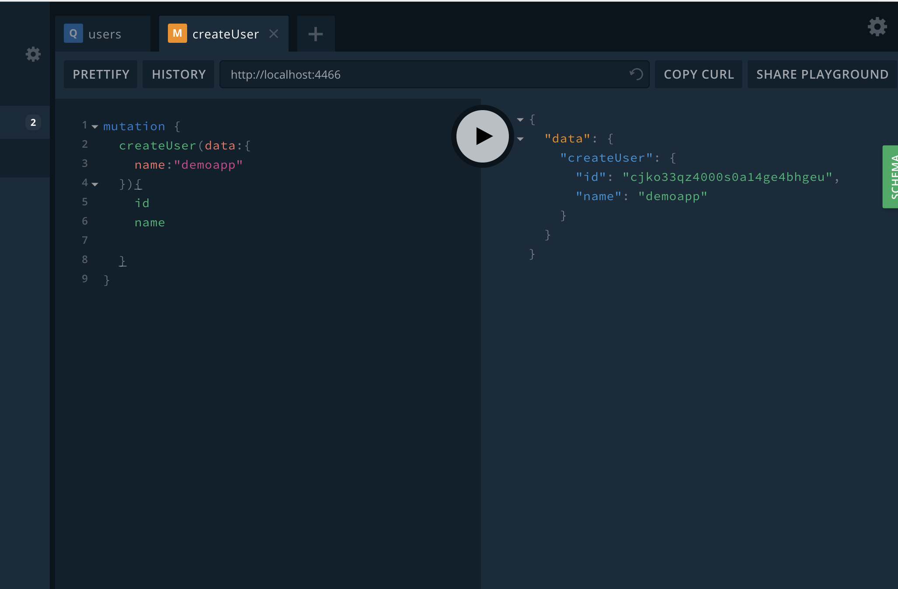
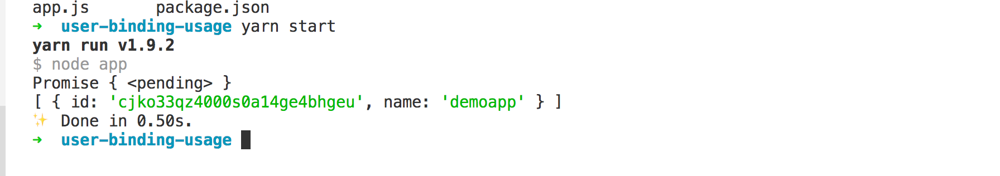

# simple graphql bingding

> with prisma provider basic graphql server

## start prisma server

* install prisam cli

```code
npm install -g prisma
```

* deploy prisma service

```code
cd appdemo
docker-compose up -d

prisma deploy

```

* access address

```code
http://localhost:4466
```

* add some data



```code
mutation {
  createUser(data:{
    name:"demoapp"
  }){
    id
    name
  }
}

```

## basic graphql binding

* generate graphql schema

```code
npm install -g get-graphql-schema

get-graphql-schema http://localhost:4466 > myuser-graphql-binding/schemas/datamodel.graphql
```

* some bingding code && install deps

```code
see myuser-graphql-binding
yarn
```

## how to use bingding

* use npm link generate local npm call

```code
in root direcroty

npm link myuser-graphql-binding
```

* use bingding

```code
cd user-bingding-useage
yarn start
```

* result

